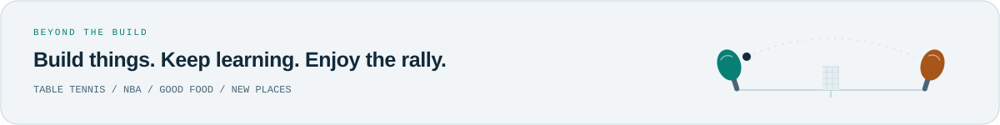

<picture>
  <source media="(prefers-color-scheme: dark)" srcset="./assets/hero-dark.svg">
  <source media="(prefers-color-scheme: light)" srcset="./assets/hero-light.svg">
  
</picture>

  <a href="https://www.linkedin.com/in/joelcuy/"><strong>LinkedIn ↗</strong></a> &nbsp;·&nbsp;
  <a href="mailto:gjoelcheah@gmail.com"><strong>Say hello ↗</strong></a> &nbsp;·&nbsp;
  <a href="#selected-work">Selected work</a> &nbsp;·&nbsp;
  <a href="#my-current-stack">My stack</a>

I'm **Joel**, a full-stack engineer working across **Malaysia and the United Kingdom**. I build web products, design backend systems, and automate cloud infrastructure — from TypeScript interfaces to AWS deployments.

I like connecting the whole system — a useful interface, a dependable backend, a repeatable deployment — and seeing it make someone's working day easier.

  <strong>AWS Certified Solutions Architect – Associate</strong> 
  First Class Honours in Computing · University of Northampton

## Results I've delivered

<table>
  <tr>
    <td align="center" width="33%">
      <h3>&lt;3 hours</h3>
      <strong>Environment provisioning</strong> 
      Previously ~1.5 weeks · Terraform IaC
    </td>
    <td align="center" width="33%">
      <h3>~4–5 hours/day</h3>
      <strong>Manual work saved</strong> 
      Automated reporting + data ingestion
    </td>
    <td align="center" width="33%">
      <h3>80% fewer</h3>
      <strong>Shipment-status enquiries</strong> 
      Customer-facing shipment tracking
    </td>
  </tr>
</table>

**Current focus:** leading an AWS migration and improving cloud costs. Savings are already being realised, with a **target of ~76% lower recurring hosting costs (~USD 30,000/year) on completion**.

## Selected work

- **Increased product adoption.** Built a customer-facing tracking application with React, TypeScript, Node.js, and SQL Server, increasing daily active users by **20%** versus the legacy system and reducing status enquiries by **80%**.
- **Consolidated a production platform.** Brought **6 production services** into a **pnpm + Turborepo monorepo** with shared UI, database, validation, logging, email, and runtime packages, enabling code reuse and consistent configuration.
- **Made changes auditable.** Built an append-only audit trail that commits alongside business writes in the **same database transaction**, with field-level history and visibility controls. Added transactional email outbox processing with retries and delivery auditing.
- **Automated repetitive operations.** Built **2 serverless workflows** using **Lambda, Step Functions, and SES** for reporting and data ingestion with a staff approval step, saving **~4–5 hours/day**. Extended automation with scheduled ECS tasks and interchangeable tracking-provider adapters.
- **Streamlined releases.** Automated deployments to **ECS Fargate** and **Cloudflare Workers** through **GitHub Actions**, replacing manual releases and saving **~1–2 hours/week**. CI assumes AWS roles through OIDC.
- **Made infrastructure repeatable.** Built reusable **Terraform** modules for AWS networking, compute, storage, email, and scheduling, cutting environment provisioning from **~1.5 weeks to &lt;3 hours**. Hardened internal access with **Cloudflare Zero Trust** and **Cognito/OIDC** authentication.

  
<strong>More experience & what I'm learning</strong>

   

  - **Real-time AI interfaces:** Integrated multilingual AI voice and LLM APIs into React + TypeScript dashboards, streaming live transcripts and intent events over WebSockets. Took frontend features from Figma to production-ready components.
  - **Internal tools & UI/UX:** Led Svelte frontend development for problem reporting and facility booking, reducing development time by **2.5 weeks**. Applied Figma-based UI/UX improvements across BIM and facilities-management modules.
  - **Peer mentoring:** Taught R/RStudio data analysis to **300+ students**, including data cleaning, visualisation, and statistical fundamentals.
  - **Learning next:** Preparing for **AWS Solutions Architect – Professional** and continuing to explore platform architecture and cloud cost optimisation.

## My current stack

| Layer | Tools I use |
| :--- | :--- |
| **Languages** | TypeScript · JavaScript · SQL |
| **Frontend** | React · Vite · Tailwind CSS · TanStack Query & Table · Zustand · React Hook Form · React Aria |
| **Backend & data** | Node.js · Express · Zod · Kysely · SQL Server · Prisma schema & type generation |
| **Cloud & edge** | AWS ECS Fargate · Lambda · Step Functions · S3 · CloudFront · SES · Cognito · Cloudflare Workers & Zero Trust |
| **Build & delivery** | Terraform · Docker · GitHub Actions · pnpm · Turborepo · Linux |
| **Quality & design** | Vitest · Testing Library · Playwright · ESLint · Prettier · Figma |

## Away from the keyboard

**Table tennis has been part of my life for years** — I represented Negeri Sembilan at national competitions for five consecutive years. I also follow the NBA, travel for the food, and provide live Mandarin → English translation at church.

English · Mandarin · Malay · conversational Cantonese. Always happy to talk software, cloud architecture, or where to find a good meal.

<picture>
  <source media="(prefers-color-scheme: dark)" srcset="./assets/rally-dark.svg">
  <source media="(prefers-color-scheme: light)" srcset="./assets/rally-light.svg">
  
</picture>
